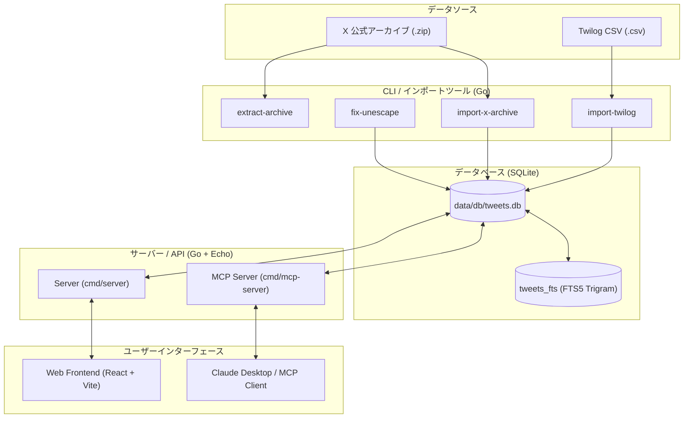

# Architecture & Overview: twilog-archive

`twilog-archive` は、過去の X (旧Twitter) アーカイブデータや Twilog の CSV データをローカルの SQLite データベースに統合・保存し、高速な全文検索・日付別閲覧・AIチャット（MCP）連携を提供するシステムです。

---

## 1. システム全体図



---

## 2. ディレクトリ構造とコンポーネント役割

### バックエンド (`cmd/`, `internal/`)
- **`cmd/server/`**: Web UI 用の REST API サーバー（Echo フレームワーク）。`web/dist` の静的ファイルを埋め込み可能。
- **`cmd/import-x-archive/`**: X (Twitter) の zip アーカイブに含まれる `tweets.js` 等をパースして DB にインポート。
- **`cmd/import-twilog/`**: Twilog からエクスポートされた CSV をパースして DB にインポート。
- **`cmd/extract-archive/`**: zip 内の添付画像・動画等のメディアファイルを抽出・配置。
- **`cmd/mcp-server/`**: Model Context Protocol (MCP) を実装し、Claude Desktop などの AI からツイート検索機能を利用可能にする。
- **`cmd/fix-unescape/`**: ツイート本分に含まれる HTML エンティティ (`&lt;`, `&gt;`, `&amp;` 等) の修正ツール。

### コアライブラリ (`internal/`)
- **`internal/config/`**: 設定ファイル・DBパス管理。
- **`internal/handler/`**: REST API エンドポイント処理（ツイート検索、日付別取得、カレンダー表示データ提供等）。
- **`internal/repository/`**: SQLite データベース操作。Trigram トークナイザを用いた FTS5 による和文全文検索。
- **`internal/model/`**: ツイート (`Tweet`), ユーザー (`User`), メディア (`Media`), URL (`Url`), ハッシュタグ (`Hashtag`) の構造体定義。
- **`internal/xdata/`**: X アーカイブ特有の JS/JSON フォーマットの解釈。
- **`internal/text/`**: HTML アンエスケープ処理等の文字列整形。

### フロントエンド (`web/`)
- **React 18 + TypeScript + Vite + Tailwind CSS**
- ツイートのタイムライン表示、日付カレンダーナビゲーション、キーワード検索、メディアギャラリーなどを提供。

---

## 3. データベース設計 (`sql/schema.sql`)

SQLite データベース (`data/db/tweets.db`) の主要テーブル構成：

- **`tweets`**: ツイート本文、投稿日時 (`created_at`, `created_date`), ユーザー情報, ログ種別 (`log_type`: 1=Twilog, 2=Xアーカイブ)。
- **`users`**: ツイート投稿ユーザー情報。
- **`media`**: 添付画像・動画の直URL、タイプ (`photo`, `video` 等)。
- **`urls`**: ツイート内の展開前/展開後 URL マッピング。
- **`hashtags`**: ツイート内のハッシュタグ。
- **`tweets_fts`**: FTS5 仮想テーブル (Trigram tokenized)。`tweets` テーブルの `INSERT`, `UPDATE`, `DELETE` に応じてトリガーで自動同期。

---

## 4. ビルド & 実行コマンド (Makefile)

```bash
# WebフロントエンドとAPIサーバーを同時に開発起動
make dev

# APIサーバー単体の起動
make run

# Webフロントエンドのビルド (web/dist 生成)
make build-web

# X アーカイブ zip のインポート
make import ZIP=/path/to/twitter-archive.zip

# Twilog CSV のインポート
make import-twilog CSV=/path/to/twilog.csv
```
